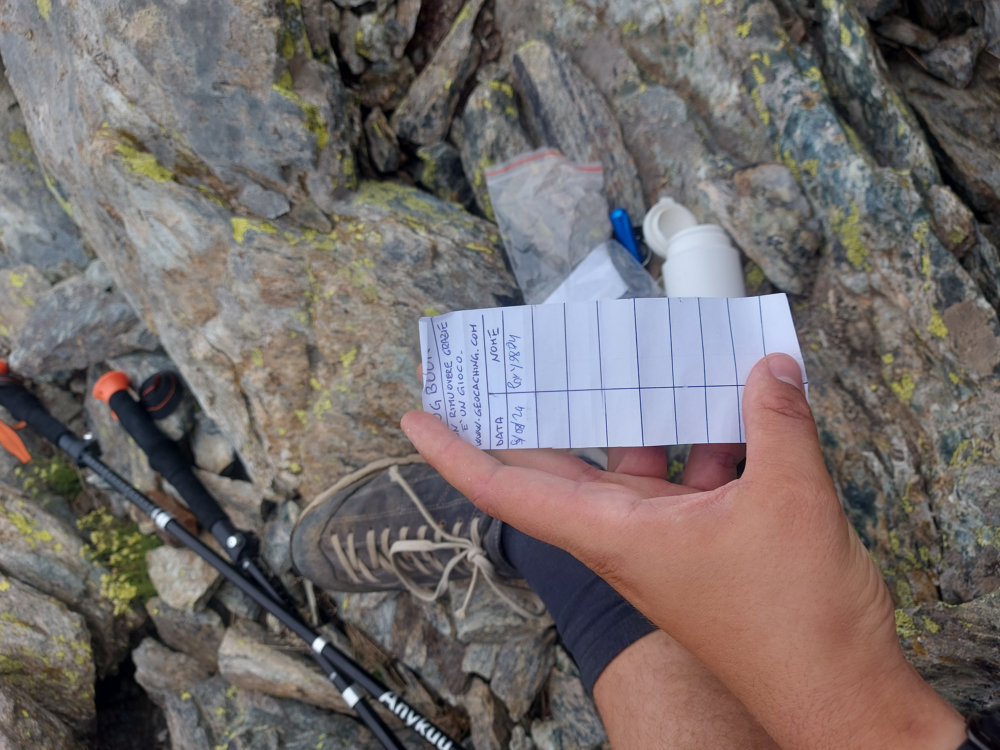
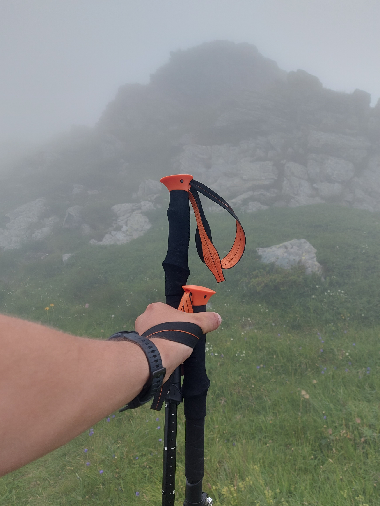

# Punta Lunella
Storia completa della giornata [qui](https://github.com/lory9894/geocaches_log/blob/main/05_07_24_Lunella/log.md)
Da parecchio tempo avevo sotto gli occhi questa vetta, da quando sono andato alla Grand' Uja.
Non essendoci nessuna cache avevo in programma di venire a metterla io.
Così, salendo una volta a Patanua con [gbosio](https://coord.info/PR133YV6) propongo di allungare e fare questa vetta. Problema, arrivati al colletto becchiamo un bel lastrone di ghiaccio che si estende su tutto il versante (all'ombra) e non possiamo proseguire.

Il tempo passa, l'idea rimane inattuata, finchè non mi arriva la mail di pubblicazione di questa cache. fabryage ha fatto il lavoro sporco per me, ora ho una scusa per andare sù.
Sono al mare ma non ho timore che qualcuno mi freghi l'FTF, la cache è abbastanza impegnativa e non credo che qualcuno la farà prima di me, anzi, onestamente credo che in pochi saliranno da Prarotto, optando per l'alternativa più leggera a Nord (pian Fume).
Rientro il 3 dalle vacanze, prima giornata libera lunedì.

Parto di buon mattino (7.00) ma tra un imprevisto ed un camion che mi rallenta inizio a camminare alle 9.00, temo il caldo e la mancanza di acqua, così ho dietro 4,5l di acqua.
Il caldo all'inizio si fa sentire, per fortuna la faggeta è fresca e protegge da sole, arrivo all'alpe Formica in un attimo.
Qui una piacevole sorpresa, nuvole! Il sole è coperto e la temperatura è perfetta, non mi posso godere il paesaggio ma almeno non soffro il caldo.

In 1h50 sono a Patanua, dove inizio a patire un po'. Sarà che sono meno allenato (questa è la prima camminata seria da almeno 4 mesi) sarà che il sentiero è accidentato, sarà anche l'acclimatamento alla quota (venerdì ero a 0m slm) ma mi sento fiacco e rallento molto.
Così per fare gli ultimo 400m di dislivello ci metto più di un'ora.
Il paesaggio è stupendo, la pietraia è affascinante, ed il canalone a nord ha ancora tracce di neve.

Arrivo all'attacco finale dove mi aspetta un po' di facile arrampicata. Di nuovo nebbione, vedo la cima solo quando sono a 100m da essa.
Così dopo 3h20 di cammino arrivo in cima, dove firmo il libro di vetta. Bellissima l'idea di scrivere lì le coordinate, spesso nei libri di vetta si trovano storie toccanti ed interessanti, questo è un incentivo a leggerli al posto che firmarli solo.

Mangio in cima e vado alla ricerca della cache,l'owner è stato clemente e non è troppo distante. Nonostante l'indizio generico la trovo subito grazie alle coordinate precisissime.

TFTC, lascio FP per la bella camminata.

Continua a [punta Cruvin](https://coord.info/GL1CP89A5)
# Punta Cruvin
Storia completa della giornata [qui](https://github.com/lory9894/geocaches_log/blob/main/05_07_24_Lunella/log.md)

Questa cache non era strettamente in programma, ma 3 motivi mi hanno spinto a farla.
1 fa fresco ed ho ancora tantissima acqua.
2 dalla mia cartina risulta solo un sentiero da sud, ma l'owner cita la cresta a nord-est che mi evita di scendere 200m per poi risalire.
3 sono un'ora in anticipo rispetto alla mia tabella di marcia.

Così scendendo dalla Lunella mi dirigo verso la cresta, e qui la nebbia e la distrazione mi fanno compiere un errore madornale.
Le nuvole si aprono e mi permettono di vedere le cime (bellissime a proposito), così noto una croce di vetta.
Non credo nella foto si noti ma vedo questa piccola croce, che in realtà è la cima di Rocca del forno.
Guardo la cartina e questa mi mostra che tra me e Cruvin c'è un piccolo colle, che però nella realtà non esiste.
Quindi: ho visto la croce, c'è un colle sulla mappa, la nebbia mi impedisce di vedere la cima di questo fantomatico colle mi convinco che la croce sia la cima di Cruvin e che quello che ho davanti sia il colle.
Decido di aggirare il colle da sud e proseguire verso la croce, ma a metà strada noto degli ometti segnavia. 
Aspetta, perchè qui c'è un sentiero? prendo il telefono e faccio un controllo con il GPS, mi rendo conto di essere finito a sud di Cruvin e di essere sull'altro sentiero.

Poco male, sono sceso di 100m e devo risalirli, ma questo errore mi mostra punta Lunella da un'altra prospettiva, che prima, a causa della nebbia, non avevo potuto apprezzare.

Così risalgo e raggiungo la cima, dove trovo la cache facilmente, anzi, mi ci siedo sopra. Poi guardo il telefono e noto di essere esattamente a GZ.
Firmo la cache e riparto, ma nel frattempo la nebbia è diventata parecchio fitta. la visibilità è ridotta a 10m, a tratti 5.

Questo mi fa completamente perdere la traccia, che già di per sè non è chiarissimo, e mi ritrovo a scendere per un canalone.
Qui l'erba bagnata mi fa fare 2 scivoloni, di cui uno abbastanza brutto, ma fortunatamente non mi faccio male.
Ritrovo il sentiero e scendo ad una lentezza esasperante, arrivo al sentiero (quello verso la Lunella) dopo le 15:00, in pratica un'ora per scendere 300m di dislivello.
Che avventura! mi sono divertito ma sono anche molto contento di scendere, finalmente.
TFTC. Grazie per questa cache ma sopratutto per questo giro, che credo di aver svolto esattamente come consigliato dal owner (Lunella, Cruvin, sorgente). COnsiglio a tutti di farlo, è faticoso ma molto appagante. 

Log precedente a [punta Lunella](https://coord.info/GL1CP7ZGY)

# La fonte nascosta
Dopo aver trovato Punta Cruvin, mi dirigo qui alla fonte. 
Non descrivo il raggiungimento del luogo (sarebbe spoiler) ma comunque è stato abbastanza scarso di sorprese.
Invece il posto è una gran sorpresa! Veramente suggestivo.
Come direbbe qualcuno "piccolo ma caratteristico".
L'acqua è fresca e limpidissima (non l'ho bevuta, non avendo assolutamente bisogno di farlo, diciamo che in caso di emergenza non mi farei troppi problemi).

Così dopo un bel lavaggio mani e faccia, cerco la cache, che si trova facilmente.
TFTC, lascio FP per il posto fiabesco.
