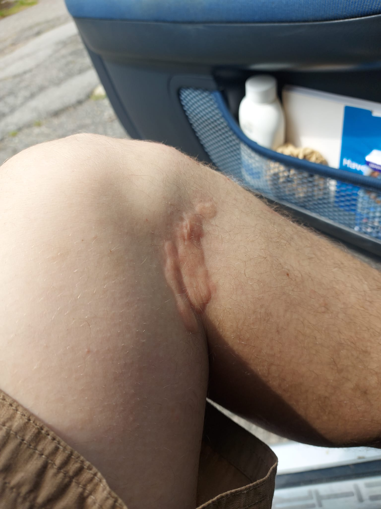

# Prefazione
01/07/2024. L'idea originale era di andare al lago di Como a fare qualche grotta. Noi con zero esperienza di speleologia non ce la stentiamo di mantenere tale piano quando il tempo volge al brutto. Certo, le grotte sono semplici, solo 50-80m di profondità, senza calate ne particolari "strettoie", però il meteo da 6mm e l'idea di beccare un bel sifone pieno d'acqua che ci impedirebbe di risalire proprio non ci piace.
Così cambiamo obbiettivo ma non piani. Sempre speleo, sempre dormendo in auto, ma Pugnetto e non Como.
Ora ... dormire in auto.....

07/07/24, siamo in macchina, io e JohnRain92 alle 19:00 a Venaria, abbiamo già fame ma ci tocca un'ora di auto fino a Pugnetto. Arriviamo, scaldiamo sul fornellino da campo un bel piattone di pasta con sugo alle melanzane e mangiamo.
Poi arriva il momento di dormire, l'auto è un 4x4 spazioso, ma non abbastanza spazioso.
Detta semplicemente, non ci stiamo, non c'è modo. È chiaro fin da subito che non c'è speranza di dormire in auto.
Sono preparato all'eventualità, ho la tenda in macchina, certo che avrei potuto provare prima a mettere il materassino in auto, ma noi siamo così, viviamo alla giornata e non disdegnamo l'avventura.

Perciò parte la lunga odissea di trovare un posto dove piantare la tenda.
Optiamo per piazzarci davanti ad uan baita ancora in uso, ma non attualmente abitata. L'idea di dormire dentro la baita ci passa per la testa, ma non vogliamo rischiare di essere svegliati da un padrone di casa arrabbiato o da un paio di ratti interessati ai nostri biscotti.
Montato (male) un telone sopra la tenda, perchè comunque non ci va di prendere acqua, ci infiliamo nei sacchi a pelo e passiamo proprio una bella serata chiacchierando, scambiandoci barzellette sui carabinieri e ridendo degli strani versi che sentiamo.
Volatili? cinghiali? roditori? boh, per stare più tranquilli azzardiamo due diverse strategie, JohnRain92 si porta un mattone in tenda, io ribattezzo questi strani animali "gibboni in amore" e cerco di non pensarci.

La notte passa, senza visite da parte dei "Gibboni", ed alle 7:00 siamo svegli (stranissimo, in tenda di solito la luce mi sveglia alle 5:00). Colazione dei campioni (pancacke con il miele), smontiamo la tenda e via verso la grotta.

# Pugnetto
Arriviamo con mezz'ora di anticipo eppure la guida (Walter) è già lì. Un ragazzo che ha l'aria di essere molto esperto, ma che si rivela essere anche molto affabile e simpatico. Nell'attesa degli altri partecipanti parliamo di altre grotte e delle competenze necessarie per affrontarle.
Poi finalmente siamo tutti, un gruppetto di 10 persone, e ci infiliamo in grotta.

So bene che questa sarebbe la parte più interessante del log, la grotta, l'avventura, cioè che abbiamo imparato e vissuto. Però è difficilissimo riproporre a parole l'esperienza, andate e fatela.
L' esperienza è meno "avventurosa" del previsto, ma molto più interessante. La grotta è molto più grande di quanto mi aspettassi, e la guida ci racconta una marea di dettagli geologici, storici e biologici che mai avremmo imparato se avessimo visitato la grotta in autonomia.
Nota particolare è "l'esperienza di buio" che ci propone la guida, spegnendo le luci e facendoci capire quanto sia buio in una grotta. Poi ci racconta di un suo amico biologo che entrato in questa stessa grotta ha esaurito il carburo ed è dovuto tornare a tentoni all'uscita.
Insomma, tra dettagli geologici, storie di pipistrelli e battute la guida ha reso l'esperienza interessante ed indimenticabile, forse meno avventurosa, ma indimenticabile.

In qualche modo riusciamo a trovare la cache senza che nessuno ci noti, a parte una signora che per assurdo sapeva già del geocaching ed a cui non abbiamo dovuto giustificare nulla. TFTC. lascio un FP

# Sentiero per santa cristina #1
Dopo la grotta abbiamo tutto il pomeriggio libero, così lo dedichiamo a questa passeggiata che avevamo già adocchiato qualche settimana fa.
Parcheggiamo al waypoint ed iniziamo a salire, un micio di meno di un anno della borgata mostra uno spiccato interesse per il bastone da trekking di JohnRain92 e per mezzo chilometro ci segue, aggredendo la punta come fosse una preda, fino a che non si stanca e ci abbandona.

Saliamo su per un sentiero che non esiste. rovi, altri rovi, ortiche.
Giungiamo ad un ponte crollato e lo aggiriamo, poi finalmente a GZ. La cache si trova subito, firmiamo e riposizioniamo.
Questa cache segna la fine del tratto "giungla" ed all'andata ha dato qualche problema, ma è stato al ritorno che ha iniziato a mostrare i denti, o meglio le spine.
Quello che all'andata era stato un sentiero difficoltoso al ritorno è stata una maledetta trappola che al mio amico ha causato un enorme livido sulla tibia (JohnRain92, dovevi continuare a prendere a calci i pali) ed a me una puntura di qualche strana pianta che mi ha causato un bruttissimo rush cutaneo (che fortunatamente è passato in poche ore).

Insomma, torniamo alla macchina con le balle girate, e con strani gonfiori, ma contenti della giornate e delle belle cache.

# Sentiero per santa cristina #2
Superato il tratto di giungla del #1, decidiamo di fare anche il #2. Il sentiero è molto più semplice, e qui inizia a diventare spettacolare. La scalinata descritta dal listing è veramente fiabesca ed anche la vista è molto bella.
La cache si trova facilmente e possiamo proseguire alla vetta

# Sentiero per santa cristina #3
Il sentiero è pieno di alberi caduti, ma scavalcabili.
Dal cartello segna un'ora e 10, noi ci metteremo 40 minuti, ammetto però faticando.
La salita è proprio bella, in una faggeta che ci tiene freschi, appena sbuchiamo dal colle la nebbia ci avvolge.

Ogni tanto la nebbia si dirada e possiamo vedere il panorama, ma nebbia o no in cima il luogo è incantevole.
Prima troviamo la cache (non senza difficoltà) e poi ci godiamo il luogo e la vista su Cantoira (unica valle senza nebbia).

Interessantissima anche la storia della chiesetta, secondo me tutte le costruzioni sono state fatte con pietre del luogo, impensabile portare tutte le pietre da valle.
TFTC, grazie per averci fatto scoprire questo posto, vale un FP per la vista (che non abbiamo visto) e per la passeggiata in sè.

# Ex lost place, Vrù
Questa giornata come le nostre forze non ha fine (Storia della giornata completa disponibile [qui](https://github.com/lory9894/geocaches_log/blob/main/07_07_24%20Pugnetto_Vru/log.md)). Siamo in zona, facciamo ancora questa cache!

La multi non viene svolta come si dovrebbe, dato che al posto di andare a GZ iniziamo a vagare per Vrù, curiosando.
Vediamo una indicazione alla "altalena gigante" e non possiamo non andare a vedere, rimarremo delusi dato che non è mica tanto gigante....
Da lì mi rendo conto che scendere a GZ è uno spreco di tempo, la cache è sicuramente in un altro punto più avanti nel sentiero, così proseguiamo. facendo attenzione a riconoscere la foto spoiler.
In realtà JohnRain92 l'ha già trovata, ma se ne sta ben zitto (gentilmente) e mi lascia il divertimento.
Così l'accordo diventa "se superiamo GZ ti avverto".

camminando sul sentiero riconosco GZ e trovo presto la cache, davanti a due lumache che si stanno accoppiando.

Bellissimo posto Vrù, molto particolare e molto curato.
Tornato a casa ottengo testimonianza di prima mano del luogo prima che diventasse una EX-lost place.
Infatti salta fuori che i miei genitori si sono conosciuti proprio lì a casa di un amico in comune che aveva una delle casette di pietra e la usava d'estate per le vacanze.
Il periodo era proprio quello pre-abbandono, quando il posto era ancora abitato ma si stava velocemente svuotando.
TFTC.

# La mole d Rivin