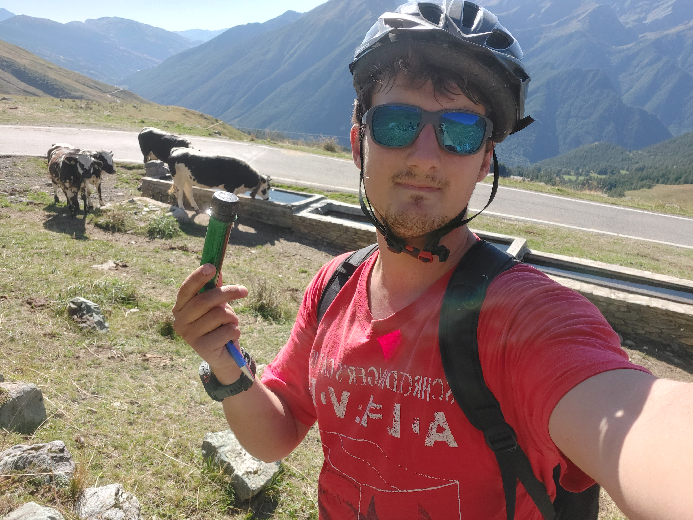
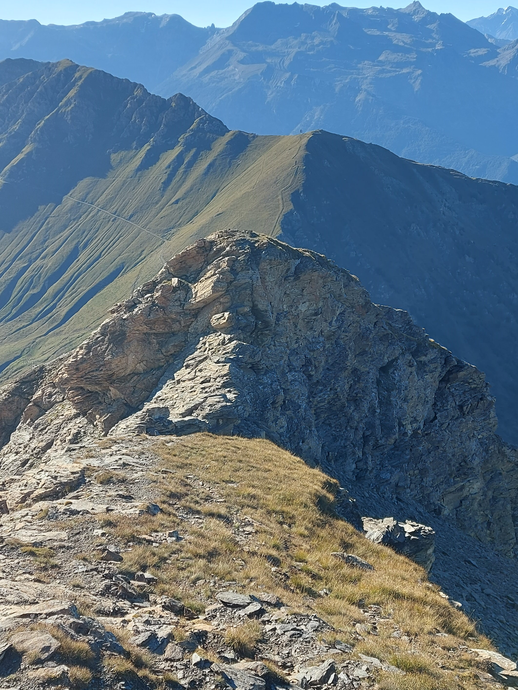
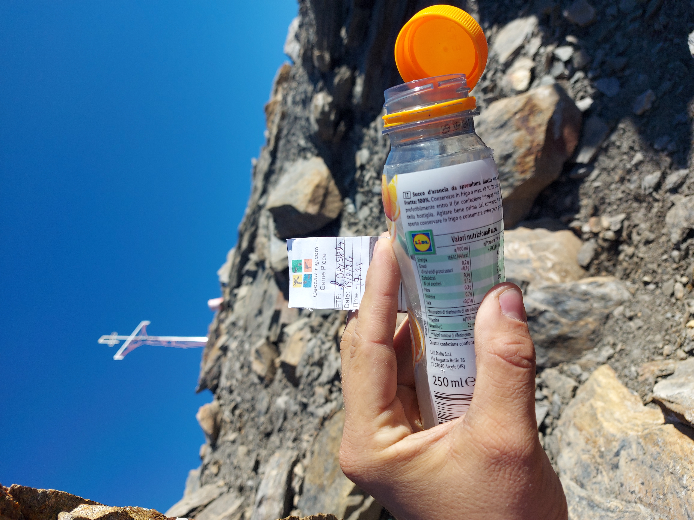
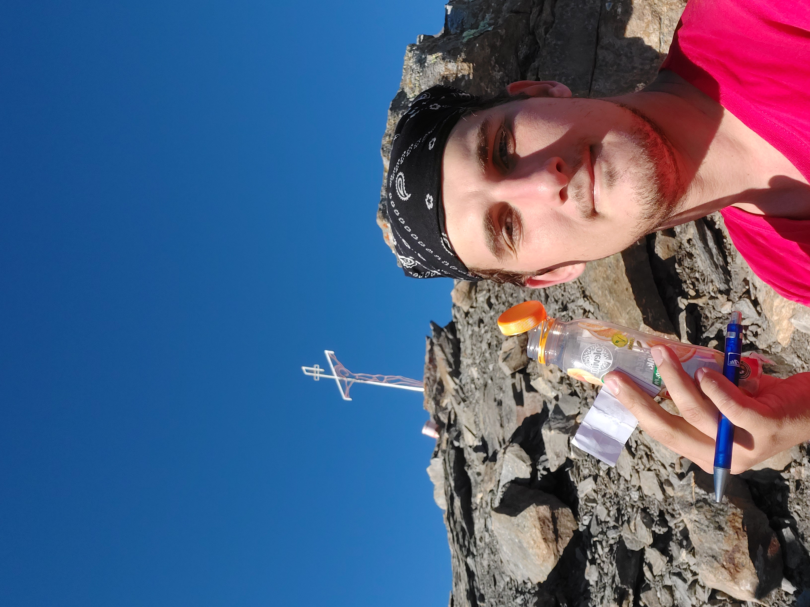

# HABT
[log completo della giornata qui](https://github.com/lory9894/geocaches_log/blob/main/15_09_24_Colle_Finestre/log.md)
Inizia anche per me l'avventura di HABT.
Inizia ben prima di quando arrivo al colle delle finestre.

Planning, disegnamo il gpx, in che periodo lo faccio?, ce la farò?, con che bici lo faccio?, scaricare tutte le cache.

Partiamo dal presupposto che io non sono un ciclista.
Uso molto la bici ma non sono un ciclista, sono uno di quelli che la bici la usa per spostarsi in giro e per farsi giretti nel weekend, non per fare sport.
Komoot e gbosio mi fanno terrorismo psicologico. 
"É tosta se non sei allenato, prendi la bici elettrica!".
La mia possibili scelte sono: una bici da gravel con la trasmissione un po' scassata (mia), una MTB di mio padre ed una e-bike del padre della mia fidanzata.

Finalmente è il 15 settembre e sono al colle delle finestre pronto a fare HABT.
In realtà mi fermo un attimo a guardare la cima Pelouxe, attratto più dalle montagne che dalla bici, ma sono venuto qui con un obbiettivo.
Ho preso l'elettrica, perchè non ho voglia di passare da casa dei miei a prendere la MTB e perchè a quanto pare è dura salire, pessimo errore.
Principalmente perchè l'elettrica non è una MTB è una Fat Bike, ideale per il tratto Assietta-Finestre, per niente adatta al primo tratto.
In secondo luogo perchè con l'elettrica diventa davvero una passeggiatina molto semplice, avevo voglia di soffrire un po' (ciò mi porterà a concludere la giornata con una cima, il [Pelouxe](https://coord.info/GL1D0X4FN))

Comunque, parto ed inizio a salire, ho programmato sul nuovo orologio Garmin super figo la strada e le cache, in modo da non stare a guardare tutte le volte il telefono e farmi avvisare quando sono in prossimità. 
Ma lui non mi avvisa.
Supero la prima e niente.
Quindi il mio piano di pedalata tranquilla salta, devo di volta in volta mettermi a guardare il telefono.

Superata la seconda cache altro problema informatico.
c:geo per alcune cache non mi ha salvato la foto spoiler.
Così, senza ragione, alcune cache non hanno più la foto spoiler, ovviamente le cache senza foto spoiler corrispondono perfettamente alle cache situate dove non prende il telefono, quindi non posso nemmeno guardare la foto dalla app ufficiale. Un disastro.
Per fortuna l'owner è famoso per le coordinate precise e tutte le cache si fanno trovare senza troppi impicci, nonostante gli hint senza foto spoiler siano inutili.

Arrivato a #07 torna internet e posso scaricarmi le foto spoiler che mi mancano, così faccio pranzo lì.
Poi inizia la discesa.
Discesa che sarebbe stupenda se non fosse che la Fat Bike è un macigno difficilissimo da guidare, soprattutto sulla strada stretta e spesso interrotta da piccole frane, ed ogni 200 metri mi devo fermare per cercare cache.
Insomma le continue interruzioni smorzano molto il divertimento, ma d'altra parte se son venuto quì è per le cache....
Inizio veramente a divertirmi dopo le caserme, quando la strada si allarga e le cache diventano meno frequenti. Dal colle dell Assietta proseguo fino all'omonima cresta (bellissimo tratto, veramente da ripetere) ed in un attimo è ora di scendere.

Scendendo l'ostacolo più grosso è il traffico, ma a parte un paio di motociclisti stronzi che sgasano durante i sorpassi sollevando terra e pietrisco, è la parte più godibile.
In un tratto di strada supero anche 2 motociclisti! la bici, per quanto pesante, è decisamente più maneggevole delle loro Turing quindi sono molto più veloce.
Conoscendo molti motociclisti, perlopiù stradali in realtà, credo di aver arrecato un danno notevole all'autostima dei due.

Sul finale mi attendono un paio di incontri con animali vari, che inserisco direttamente nei log.
Alla #16 l'hint dice "sotto il grosso sasso", così sollevo il sasso e affianco alla cache trovo un bel serpente.
Sul momento mi pare una vipera, ma non ci penso più di tanto più che altro perchè si allontana tranquillamente e non sembra aggressivo.
Firmo e con molta attenzione riposiziono. Oggi a casa mentre scrivo questo log ho la conferma, era decisamente una vipera.

Invece GZ della #18 è invaso da mucche. Sono parecchio abituate a vedere umani ma comunque non gradiscono un ciclista che si piazza vicino agli abbeveratoi.

Finisco il giro e sono di nuovo all'auto, ma non sono stanco. 
O almeno, sono stanco ma non quanto vorrei, ho abbastanza energie per affrontare qualcos'altro, cosa? Il Pelouxe? sembra bello impegnativo! però un FTF..... vabbè ci ragiono mentre vado a loggare la cache del colle delle finestre

In sostanza giro bellissimo, lascio un FP sulla cache che più mi è piaciuta, ma vale per tutto il giro.
Io l'ho affrontato male, non fa per me fare i trail in bici ed inoltre la bici era veramente inadatta.
Non credo lo rifarei, potrei invece pensare di rifarlo con la MTB, questa volta senza dovermi preoccupare delle caches.
In ogni caso vista spettacolare, TFTC e TFTT (thank for the trail).

# Colle delle Finestre
[log completo della giornata qui](https://github.com/lory9894/geocaches_log/blob/main/15_09_24_Colle_Finestre/log.md)
Finito HABT sono in questa situazione di dubbio, vado o non vado a fare FTF alla cima [Pelouxe](https://coord.info/GL1D0X4FN)?
Ciò che più mi ostacola e la condizione del mio ginocchio, ultimamente quando salgo o scendo le scale fa male e mi sto impegnando a stare a riposo finchè non si riprende.
Così questa cache fa un pò da "test drive", il giro in bici mi ha stressato il ginocchio? pare di no, arrivo senza alcun fastidio a GZ, firmo dopo un brevissimo boulder e ritorno all'auto. 
TFTC

# Pelouxe
[log completo della giornata qui](https://github.com/lory9894/geocaches_log/blob/main/15_09_24_Colle_Finestre/log.md)
Salendo al colle delle Finestre mi era subito caduto l'occhio su questa particolare cima, però ero salito su con un altro obbiettivo e sopratutto non dovrei fare dislivello per evitare di infiammare ulteriormente il ginocchio.

Finito HABT e appurato il fatto che sto sostanzialmente bene guardo verso l'alto.
Da sotto non sembra affatto così faticosa, non si percepisce la verticalità di questo pendio, che si può invece ben notare salendo al monte Pintas (segendo la strada militare insomma)
Non dovrei sforzare il ginocchio.... ma sono solo 600m, e poi non ho male, ma poi c'è un FTF in ballo.
Tutte scuse, sopratutto quella dell'FTF dato che tra 15 giorni chiuderanno la strada.

In ogni caso mi convinco a salire, prendo la strada più diretta non per scelta, ma perchè non ho il tempo di fare il giro lungo e soprattutto non voglio stressare il ginocchio più del dovuto (invece scendere da un pendio con circa 45% di pendenza è un toccasana).
Mi trae anche in inganno l'owner che chiamandolo il "sentiero da Bignole" mi illude sia più semplice di quanto immagino.
ed invece no, che mazzata allucinante. Non c'è modo di mantenere un buon passo e regolarizzare il fiato, sono 50 minuti di fiatone e polpacci che bruciano.
Che poi .... Bignole .... Io bignola non sono di sicuro perchè arrivo già da HABT, all massimo sono uno zabaione, o almeno le gambe hanno quella consistenza.
Ma poi 1000 volte meglio la cresta aerea che quella mazzata di salita!!
E non pago arrivato all antecima mi trovo su uno sperone roccioso completamente esposto, per raggiungere la vetta, anche lei molto aerea, bisogna disarrampicare un breve passaggio di II completamente esposto.

Da questo log sembra che non mi sia divertito, ma non è affatto così, questa cima soddisfa il bisogno di avventura che HABT non era riuscito a soddisfare. anche perchè era tantissimo che non avevo l'opportunità di fare qualcosa di un po' intenso, quindi lascio sicuramente un FP perchè lo vale.
Però se siete in dubbio sulla strada da fare .... fate la cresta.

Comunque giungo a GZ, individuo il nascondiglio e la cache "improvvisata" e regalo un logbook con annessa bustina che firmo.
TFTC, grazie per la piccola breve avventura.

Ah, per scendere? ho deciso che i miei pantaloni valevano meno del mio ginocchio e che la pendenza era tale da permettermi di scivolare di culo sull'erba morbida. Mi sono divertito tantissimo a fare il pirla.