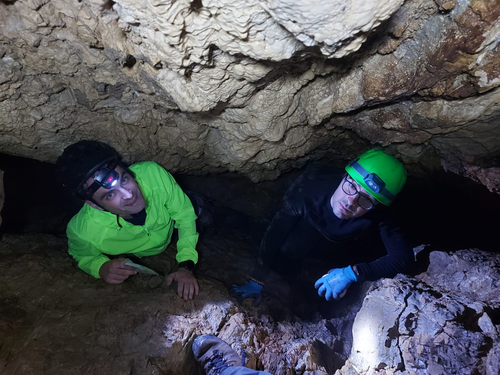
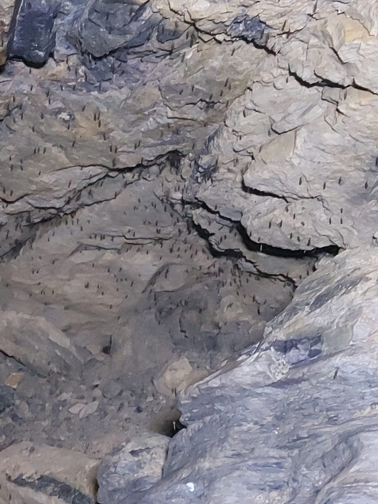
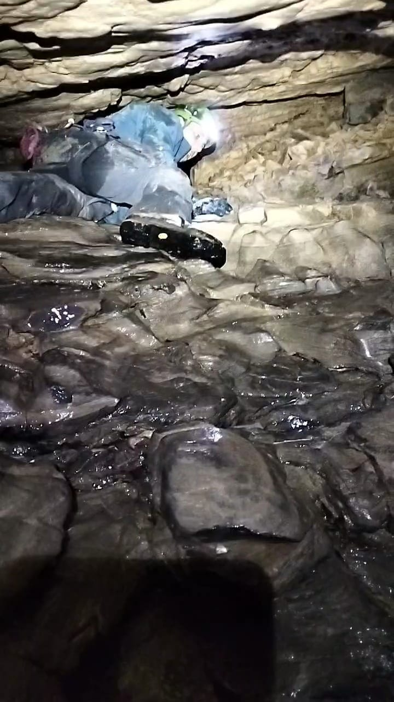

# Introduzione
Storia completa della giornata [qui](https://github.com/lory9894/geocaches_log/blob/main/18_07_24_Pian_Tivano/log.md)
Era da parecchio tempo che con JohnRain92 volevamo fare queste grotte.
All'inizio ci aveva attirato il D/T, ma io ho sempre avuto il dubbio: "si ok, ma non ho le conoscenze di speleologia".
Inoltre le piogge di questi giorni mi avevano fatto pensare che forse non era il caso di andare in grotta, finire in un sifone che si riempie d'acqua all'improvviso mi sembrava un modo stupido di morire.
Perciò si rimanda, e nel mentre si decide di fare Pugnetto (un'altra grotta, storia [qui](https://github.com/lory9894/geocaches_log/blob/main/07_07_24%20Pugnetto_Vru/log.md)).
Lì chiacchierando con la guida vengo rassicurato: le mie competenze tecniche (alpinismo, arrampicata) si adattano molto bene a fare grotte semplici, con qualche altro piccolo accorgimento, che gentilmente ci fornisce, mi sento abbastanza fiducioso.
In effetti per tutte le grotte, ad esclusione della prima, ce la siamo cavata in sicurezza quasi sempre solo usando Prusik.

Così, il giorno dopo la mia laurea magistrale, partiamo per Piano Tivano, si unisce anche gbosio, che trova il tempo nel suo fitto calendario.
L'obbiettivo è fare quante più grotte possibili, dando priorità a quelle più difficili. In primis perchè più avventurose, in secondo luogo perche vogliamo fare le calate con la corda, in ultimo per questioni di statistiche.
Alla fine effettivamente riusciremo nell'intento di fare 4 grotte, tutte le D5T5 della zona.

## Grotta Squadrada
La prima grotta è Squadrada, bella tosta.
Tosto l'avvicinamento, tosta l'entrata, tosta la calata.
Qui accadono tutti i problemi della giornata, in un sola grotta.

Andiamo con ordine: entrare.
Giunti all'entrata non trovo il punto di ancoraggio citato nel listing, boh, allestisco una sosta sul grosso albero.
Ora però sorge il dubbio: basteranno i 30 metri di corda? Il listing dice 30 metri, io ho una corda da 27 metri ed una da 60, per sicurezza usiamo la da 60.
Problema, la 60 è una mezza corda, diametro 8.5mm, i prusik non bloccano.
Ok, facciamo corda doppia. Mando giù Giuliano su un capo solo (il grigri per quanto sia fuori dalle specifiche funziona con una corda così sottile) ed io e Giacomo ci caliamo su corda doppia.
Scendendo trovo il punto di ancoraggio ... che palle.

A parte un po' di casini con la corda in avanzo siamo tutti e tre giù. Che spettacolo! la discesa è entusiasmante e la grotta è bellissima.
Esplorando un po' troviamo resti di animali e la cache, veramente una bella esperienza.

Momento di risalire.
Salgo io per primo, così in caso di problemi posso tirare su gli altri con un paranco.
Per un errore di comunicazione sale dopo Giuliano e viene lasciato giù Giacomo, con un grigri che non sa usare.
Dopo 15 minuti di bestemmie Giacomo passa al prusik, almeno lo sa usare, e sale.
Fa un po' di difficoltà non sapendo arrampicare, così lo aiuto con la corda e lo tiro su.
Facendo ciò la corda si impiglia in fondo e smuove un grosso sasso (risulterà rilevante poi), così scendo a sistemare il casino. 
Risalgo senza problemi ed arrivato all'uscita mi appendo al masso che la corda ha smosso e questo viene giù.

Un masso delle dimensioni del mio petto mi cade addosso, fortunatamente lo fermo con il braccio.
Ok, sono in cima, dove il buco si stringe ed ho un masso bello pesante che se mollo mi cade addosso. Qui finisce che mi cade addosso, mi blocca e devo chiamare i soccorsi. Qualche secondo di panico, poi mi calmo.
Delicatissimamente sposto il braccio ed il masso sta su, in equilibrio precario.
Se lo sfioro cade, quindi striscio lentamente finchè non lo supero e, come nei migliori film d'azione, appena sono in sicurezza il masso cade, sfiorandomi di qualche centimetro la caviglia.
Esco dalla grotta, speriamo non siano tutte così.

A parte il rischio, abbiamo imparato tante cose: no calate in doppia, o io o Giuliano per ultimi (per le restanti grotte rimarrò quasi sempre io), la corda da 27 metri basta ed avanza, l'owner nel listing è stato cauto a consigliare 30-40.

TFTC, Lascio un FP per la grotta stupenda! 

# Andromeda.
Dopo il casino di grotta Squadrada [che si può leggere qui](https://coord.info/GL1CHVG5Y) decidiamo di fare Andromeda.
L'avvicinamento è di nuovo intenso, ma meno!
Fatichiamo a trovare l'entrata ma alla fine ce la facciamo.

Il listing dice che dentro cè una sosta a spit, mi fido poco e opto per la classica sosta su albero. (dentro c'era la sosta ma mancavano gli spit)
Scende prima Giuliano, che continua a sostenere non sarebbe dovuto scendere lui per primo avendo meno esperienza, sfrutto un po' il dissing tra log per ripetergli ciò che gli ho detto in loco.
"si ma se scendo io per primo tu la sai fare una sosta su albero? tu magari sei meno bravo di me, ma almeno se scendi tu per primo io ti posso mettere in sicurezza"

Comunque passiamo per lo stretto ingresso (stretto per me, voi speleologi avrete un'altra idea di stretto), prima Giuliano e poi io, dato che Giacomo è turbato dall'esperienza precedente e Giuliano non si ricorda come collegare il discensore alla corda.
Comunque mi insinuo, risolvo il piccolo problema di Giuliano e proseguiamo la discesa.

Finita la calata si striscia, che gran figata. QUESTA È LA PARTE CHE MI PIACE, belle le calate, ma ne faccio già tante in montagna, la parte che mi piace delle grotte è strisciare, arrampicare, insinuarmi, esplorare.
La grotta è piccola ma molto bella, al "fondo" troviamo la cache, facilmente individuabile.
Risaliamo fino alla calata e Giuliano sale su a convincere Giacomo a scendere, io provo una nuova esperienza. Spengo la luce per risparmiare batteria, mi siedo ed aspetto, circa 10 minuti.
Il buio completo dovrebbe farmi paura, ma non è così, mi rilassa e mi da pace. Probabilmente è perchè so di essere in completa sicurezza, ma è una bella esperienza.

Mi raggiunge Giacomo, che fa ancora un po fatica ad utilizzare l'attrezzatura, ma comunque è super contento di averci provato ed essere riuscito.
Insieme usciamo, più difficile che entrare, soprattutto per me che non sono di esile corporatura (sono grasso).
TFTC, la seconda grotta più bella della giornata, lascio un FP.

# Ingresso fornitori
Storia completa della giornata [qui](https://github.com/lory9894/geocaches_log/blob/main/18_07_24_Pian_Tivano/log.md)
Terza grotta, la più bella secondo me.
Per una volta l'avvicinamento è facile! parcheggiamo subito prima del cancello piccolo (non quello ad inizio sterrata) e ci incamminiamo.

Questa grotta è particolarmente fredda, che goduria! Qui però incontro un nuovo nemico, mai incontrato prima in grotta, i moscerini!
Appena aperta la botola infatti si solleva un nugolo di queste bestiacce che ci tormenteranno per tutta la grotta.
In particolari anfratti sono tantissimi! tanto che rinuncio ad usare certi appigli per evitare di "disturbarli"

Qui c'è la corda fissa, nonostante il consiglio dell'owner la usiamo.
Corda fradicia (questa grotta è molto umida) che fa si che i nodi scorrano un po' troppo.
Però la discesa è semplice, potrebbe addirittura essere fatta senza corda, e questo è quel che rende divertente questa grotta.
Una bella grotta dove posso esplorare liberamente, senza dovermi preoccupare troppo di nodi e corde.

Così scendiamo, scendiamo e scendiamo.
Dopo una bella sezione con soffitto basso siamo a GZ e anche senza torcia UV la cache salta fuori, dato che basta spegnere le luci per vedere la vernice fosforescente.
Di li proseguiamo, fino ad un tratto dove la grotta si stringe parecchio.
Bisogna stendersi e strisciare, con l'acqua che bagna le gambe.
Mi piacerebbe provare a proseguire, ma questo va oltre la mia soglia di rischio.
Non so cosa c'è oltre, non ho indumenti impermeabili, non saprei come comportarmi se uno di noi dovesse rimanere bloccato. Tornerò, in futuro con più esperienza.

Così risaliamo, con semplicità anche perchè arrivati alla calata risaliamo in libera, senza corda, dato che salire è sempre più facile che scendere.
Usciamo e la botta di afa quasi mi stende, tornerei volentieri al fresco della grotta.
TFTC, anche qui FP 

# Buco di latte
Storia completa della giornata [qui](https://github.com/lory9894/geocaches_log/blob/main/18_07_24_Pian_Tivano/log.md)
Questa grotta è stata la meno bella della giornata, ma comunque interessante.
Parcheggiamo praticamente alla borgata a 50m dalla grotta, ignorando i divieti di transito, che comodità!
Qui qualche problemino, di nuovo non riesco a trovare i fix per la sosta, così, tanto per cambiare, sosta su albero.
In questa maniera però, come in squadrada, non so se la corda basta, anche perchè da su non si vede il fondo.
Mi calo quindi io per primo e senza problemi sono in fondo.
La parte iniziale della grotta è molto "artificiale" o meglio, piena di spazzatura. Notevole il paio di sci finito non si sa come nelle pareti di "sostegno".
Inoltre torna il mio antico nemico, i moscerini! anche questa grotta è piena di moscerini, che si agitano quando illuminati, che fastidio!

Mentre attendo i miei compagni di avventura cerco la cache, che assolutamente non trovo.
Dopo una decina di minuti nessuno è ancora sceso, anzi ricevo una chiamata da Giuliano che mi dice di risalire, non sono sicuri di aver fatto correttamente il prusik.
Risalgo, e in effetti, non è stato fatto correttamente, ma non è un problema, lo correggiamo e stavolta scendo per ultimo.

Qui per un'ora (si, esattamente un'ora) cerchiamo la cache. La foto spoiler sembra troppo generica (non lo è) e non capiamo se dobbiamo proseguire o no.
Alla fine grazie ad altre foto nei log capiamo che dobbiamo ancora scendere e finalmente troviamo la cache.

Di qui proseguiamo finchè la strada non diventa troppo stretta per i nostri gusti e decidiamo di tornare indietro.
Prima di uscire ancora una bella foto di gruppo, per ricordare la giornata, poi via, si torna a casa.

TFTC, grazie di averci fatto fare tutte queste grotte. Senza queste cache non saremmo mai venuti qui, ANZI, senza queste cache non so nemmeno se avrei mai provato a fare una grotta "seria"! attività, la speleologia, che ho scoperto piacermi tantissimo.
Quindi un enorme ringraziamento all'owner! non so veramente come ringraziarti, se mai vorrai venire a fare qualche cache "arrampicatoria" in zona Torino (ho intenzione di farne uscire qualcuna) chiamami, sarò felice di accompagnarti!