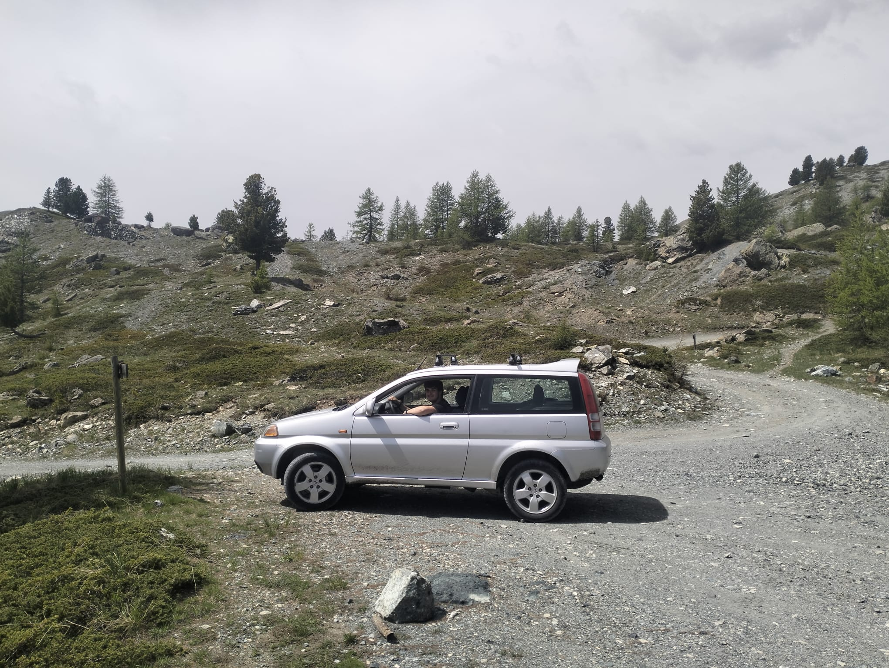

## GC8WNE9

Primo tentativo serio di camminata da dopo l'operazione al ginocchio.
Il vero obiettivo in realtà è testare la "nuova" Honda hr-v (mica tanto nuova)

Giornata all'insegna della pigrizia, partiamo pigramente tardi, prendiamo la pigra statale e saliamo il più possibile in auto. Ci faremo poi prendere ed a fine giornata avremo percorso 15km e fatto 600m di dislivello.
Il mezzo tiene benissimo, arriviamo senza problemi al parcheggio (2100m) e molliamo l'auto.
Saliamo rapidissimi verso il versante francese e di lì vediamo la nostra meta, Grand Charvia.

Da qui si delinea perfettamente la strada che compiremo, sembra tantissima ed il mio compagno pare scoraggiato, ma come al solito la strada è di più negli occhi che nelle gambe.
Così saliamo in cresta e procediamo rapidi, ma prima passiamo a prendere questa cache di strada, con una bellissima vista sul versante italiano.

## GC4ERJQ

Poco dopo inizia la salita in un canalone di sfasciume, lo affronterei più piacevolmente in inverno con un paio di ramponi ed il terreno ghiacciato, invece sono in scarpe da trekking su una pietraia innevata ... pessima scelta.
Unica difficoltà della giornata, questi 100m di dislivello si superano con fatica ma in fretta.

