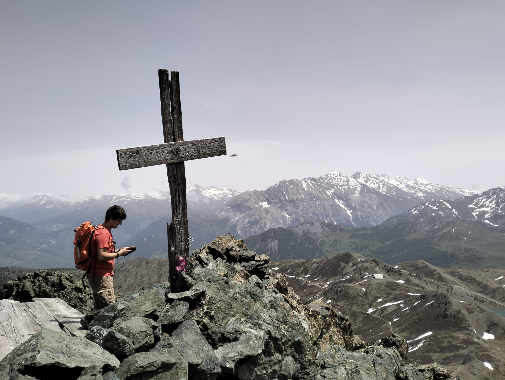
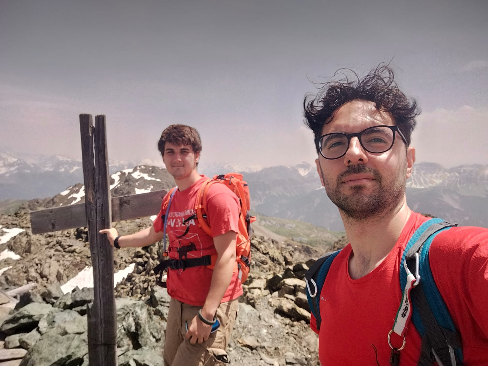
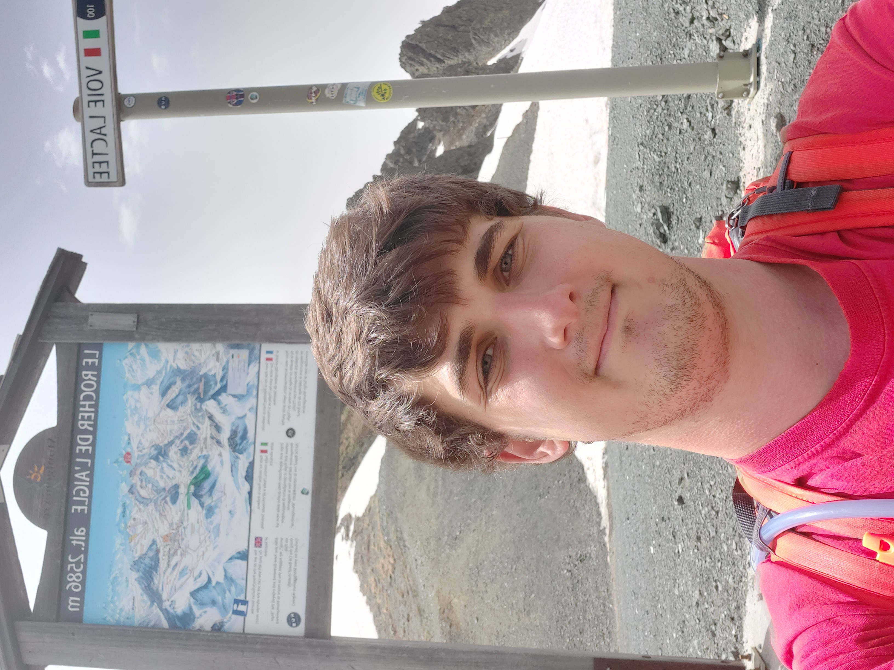
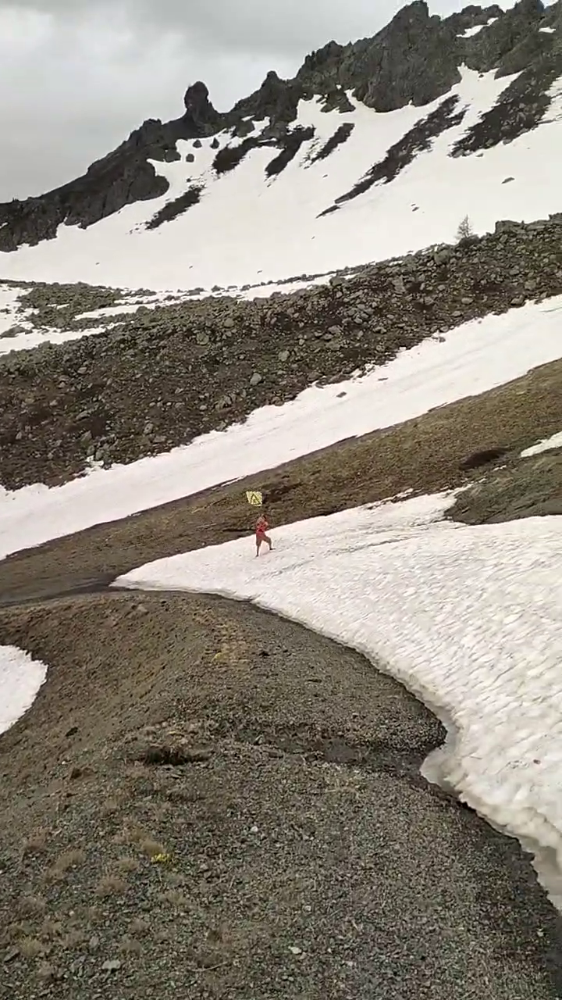
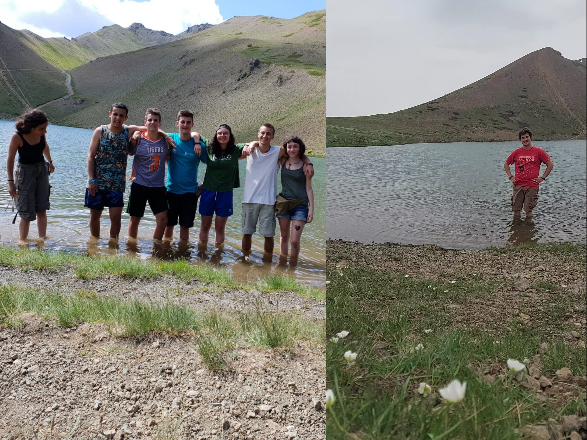
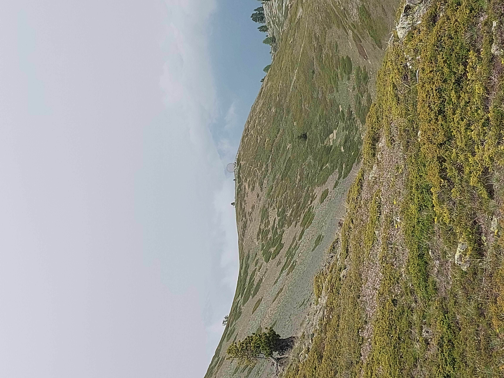

## GC8WNE9

Primo tentativo serio di camminata da dopo l'operazione al ginocchio.
Il vero obiettivo in realtà è testare la "nuova" Honda hr-v (mica tanto nuova)

Giornata all'insegna della pigrizia, partiamo pigramente tardi, prendiamo la pigra statale e saliamo il più possibile in auto. Ci faremo poi prendere ed a fine giornata avremo percorso 15km e fatto 600m di dislivello.
Il mezzo tiene benissimo, arriviamo senza problemi al parcheggio (2100m) e molliamo l'auto.
Saliamo rapidissimi verso il versante francese e di lì vediamo la nostra meta, Grand Charvia.

Da qui si delinea perfettamente la strada che compiremo, sembra tantissima ed il mio compagno pare scoraggiato, ma come al solito la strada è di più negli occhi che nelle gambe.
Così saliamo in cresta e procediamo rapidi, ma prima passiamo a prendere questa cache di strada, con una bellissima vista sul versante italiano.

## GC4ERJQ

Poco dopo inizia la salita in un canalone di sfasciume, lo affronterei più piacevolmente in inverno con un paio di ramponi ed il terreno ghiacciato, invece sono in scarpe da trekking su una pietraia innevata ... pessima scelta.
Unica difficoltà della giornata, questi 100m di dislivello si superano con fatica ma in fretta.
D'altra parte è innegabile che la vista sia stupenda.

Superato il canalone ci investe un forte vento che rende molto scomoda la ricerca e che ci accompagnerà per il resto della nostra permanenza in Francia, per fortuna però non fa freddo.
La ricerca della cache è tutt'altro che semplice, nonostante le coordinate precise. Veniamo molto aiutati da una foto di un log che ci permette di individuare la roccia giusta. Una volta individuata la spaziosa cache è nelle nostre mani.

Infine si sale in vetta, per mangiare un panino e godersi la vista, purtroppo un po' nebbiosa, comunque siamo molto contenti di aver raggiunto il semplice  obiettivo della giornata. Giornata che è tutt'altro che finita.

## GC4ERK4
Scediamo dalla Grand Charvia e ci dirigiamo a "Le rocher de l'Aigle", posto che conosco molto molto bene, ma solo d'inverno.
Infatti fin da quando sono bambino i miei genitori mi hanno sempre portato a sciare a Monginevro e questo luogo l'ho visto tante tante volte, ma sempre imbiancatissimo.
Fa molto ridere soprattutto guardare i cartelli, di solito alti poco più di un metro, poichè sepolti dalla neve, che ora svettano sopra le nostre teste.

Dopo una puntata all'ovovia per una foto ricordo da mandare ai miei genitori scendiamo di dislivello fino alla cache.

Le coordinate sono precise e la foto spoiler eloquente, ma noi siamo presi da cecità temporanea e non troviamo assolutamente nulla per diversi minuti.
Non riusciamo nemmeno a far combaciare la foto spoiler con l'ambiente circostante.
Nel frattempo i nuvoloni neri si spostano verso di noi e temiamo l'arrivo della pioggia.

Finalmente Giuliano individua un sospetto ammasso di rocce e trova la cache, firmiamo e possiamo continuare il nostro giro.
Logbook troppo umido per firmarlo. allego fotolog.

## GC4HMQ4
Il colletto verde, la piccola stradina che da "le rocher de l'Aigle" porta ad una pista nera bellissima e molto apprezzata (anche se spesso ghiacciata).
A guardarlo d'estate sembra impossibile scendere il pendio sciando, a piedi non so se oserei scendere "dritto per dritto".

A GZ c'è stata una frana ed il ritrovamento non è facile, inoltre inizia a piovigginare. Io non ho la giacca impermeabile perchè me la sono bellamente dimenticata, così prego che sia solo una pioggerellina lieve e passeggera.
Le mie preghiere vengono ascoltate e qualche minuto dopo smette.

Sulla strada di discesa trovo abbandonato un paletto di "pericolo" di quelli usati sulle piste da sci.
Per quanto mi piaccia tale sport e lo pratichi da anni sono sempre stato molto critico dell'abuso compiuto dagli impianti sciistici. Questi deturpano la montagna ed hanno uno scarso rispetto dell'ambiente, ad esempio abbandonando senza cura i loro rifiuti sui pendii.
Chè dire? ultimamente sto abbandonando questa disciplina proprio per non finanziare più un business che sfrutta in maniera così irrispettosa la montagna.

## GC8WNDR
Torniamo sul versante italiano e passiamo per questa particolare struttura, la cosa più notevole è la neve che in questo periodo è ancora presente ed ancora profonda, ma senza troppa fatica raggiungiamo GZ,
La cache si fa presto trovare e siamo subito in cammino verso il Col Saurell.

## GC8WNDX
"La traversata", sì, nome adatto.
Infatti venendo dal colletto verde per ritornare al Saurell compiamo un vero e proprio traverso su diverse colate ghiacciate.
Per Giuliano il problema è limitato, per quanto non sia semplice passare lui ha gli scarponi ed a calci riesce a crearsi dei piccoli gradini nel ghiaccio.
Io come ho detto in un'altro log non sono attrezzato (scarpe da avvicinamento) perciò seguo lui sfruttando i suoi gradini, ma ad un certo punto la neve cede ed io scivolo.
Per fortuna piantando le unghie come gatto silvestro mi arresto dopo pochi centimetri e mi evito uno scivolone di parecchi metri.

Superate le colate ghiacciate si torna sul sentiero e possiamo proseguire fino a GZ dove la cache si trova subito grazie alle foto spoiler.
Qui ci dividiamo, Giuliano torna a Sfera Mirage, io scavallo verso il lago Gignoux alla ricerca di due cache che il mio amico ha già trovato.

## GC2W8FZ
Abbandoniamo il 2024 e facciamo un salto di 6 anni, 2018.
Dopo l'esame di maturità io ed un gruppo di amici prendiamo le tende e rimaniamo a campeggiare per una settimana sotto capanna Mautino.
Siamo tutti camminatori, ma i piaceri della festa e dell'alcool ci tentano, così in quella settimana facciamo solo due gite, una delle quali al lago Gignoux.

Ricordo con affetto quel tempo, mi ricorda un bel periodo della mia vita e sopratutto mi ricorda quegli amici, così sono molto determinato a tornare a questo lago.
Così determinato da separarmi temporaneamente dal mio compagno di camminata e allungare un po' facendo questa deviazione.
Mentre rifletto sul tempo che è passato raggiungo di corsa il lago e mi viene un'idea. Fare una foto nella stessa posa della foto scattata nel 2018

## GC2W8GA
Dopo il lago Gignoux mi dirigo da solo al prossimo lago.
Dalla radio Giuliano mi fa sapere di essere giunto a Sfera Mirage ed io in breve supero il colle e ci possiamo vedere.

Nasce così un'idea stupida, trovare la cache senza usare il gps, sarà Giuliano da 1 km circa di distanza a dirmi dove andare via radio.
Pessima idea, pessima.
Infatti finisco molto più a sud di dove dovrei, dopo una decina di minuti rinunciamo a questa balzana idea.

Tornato al fedele GPS individuo il posto, però negli anni il ginepro è morto e lo spoiler non è più attuale.
Comunque la cache è lì in zona e spostando qualche sasso la trovo.
Trovo e "firmo" (fotolog perchè la cache era impossibile da firmare) l'ultima cache di questa giornata.
O forse no? 

## GC2W8GT

Torniamo in auto e non siamo stanchi. Abbiamo due scelte: Tornare verso casa facendo qualche park and grab oppure cercare una cache vicina e camminare ancora.
La scelta ricade ovviamente sulla seconda.
Così ripartiamo da capanna Mautino alla volta di questi 3 laghi minacciati da dei nuvoloni neri che promettono pioggia.
Sulla strada assistiamo anche ad un abbandono minorile, mamma papera quando ci vede scappa, seminando gli anatroccoli che non riescono a starle dietro. Complimenti mamma papera.... 

Poco prima di GZ si apre a noi uno spettacolo incredibile, la vallata sulla sinistra si apre su delle cime a picco, con delle pareti verticali, a destra invece una grossa pianura che finisce bruscamente alle pendici di una grossa pietraia.
In tutto ciò i tre laghetti, con un affioramento di pietre in centro, proprio lì si trova la cache.
Non posso che lasciare un FP per il fantastico posto.

Troviamo la foto spoiler, ma non troviamo assolutamente la cache.
Cerchiamo in ogni anfratto possibile, ma proprio non c'è.
Scoraggiati decidiamo di chiedere all'owner il permesso di fare un ripristino, ma non c'è campo.
Vabbè, noi inseriamo il ripristino e mandiamo spiegazioni dettagliate all'owner, se a lui non andrà bene cancelleremo il log.

Grazie di averci fatto scoprire questo magnifico posto. TFTC
Torniamo indietro che ha iniziato a piovere, ma riusciamo a giungere al'auto non troppo bagnati. 